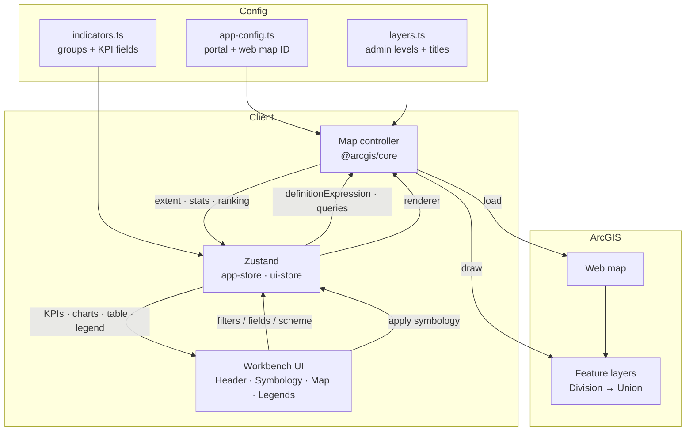
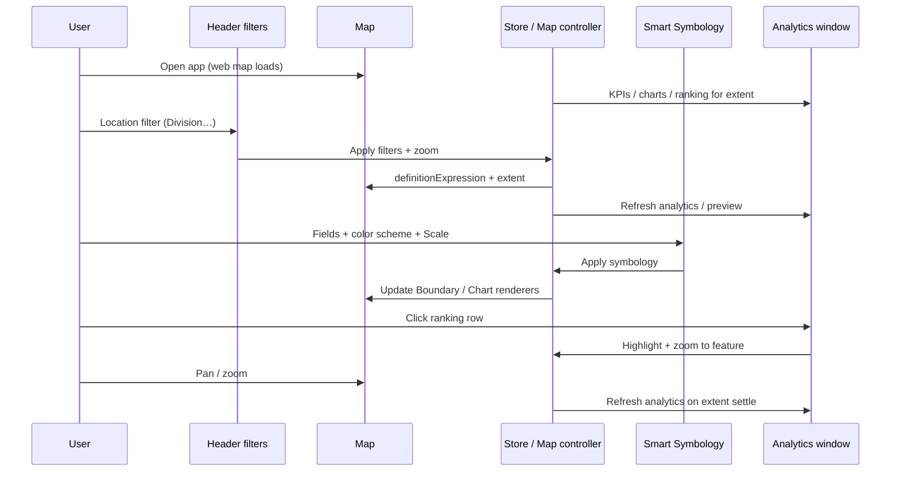

# Insight Hub Platform

Map-centric web application for administrative intelligence in Bangladesh.  
Built with **ArcGIS Maps SDK for JavaScript**, **Calcite Design System**, and a React workbench layout similar to ArcGIS Dashboards / Experience Builder.

**Live demo:** [https://insight-hub-dashboard-ten.vercel.app/](https://insight-hub-dashboard-ten.vercel.app/)  
**Repository:** [https://github.com/aunkuresri/Insight-Hub-Dashboard](https://github.com/aunkuresri/Insight-Hub-Dashboard)

---

## Features

| Area | Capabilities |
|------|----------------|
| **Header** | Branding (Insight Hub Platform); hierarchical **location filters** (Division → District → Upazila → Union/Ward) with single-click selection; **Manage Data** entry; optional auth |
| **Left panel – Smart Symbology** | Indicator groups & fields (scrollable checklist); color schemes; layer group (**Boundary** / **Chart**); independent **Scale** settings per group; Apply / Reset pinned in panel footer |
| **Map** | ArcGIS web map; zoom-driven admin level visibility; boundary popups; Map KPI bar; smart symbology legend |
| **Right panel – Legends** | Applied boundary / chart symbology legends |
| **Analytics window** | KPI cards, composition charts, ranking table (row click → highlight / zoom), map preview that follows filters |
| **Manage Data – Add Data** | Select indicator group & fields; Append or Replace mode; CSV attachment (Calcite button); join always at **Union / Ward** level (not user-selectable) |
| **Manage Data – Modify Data** | **Add Field** (create attribute on layers + catalog); **Modify Field** (move/remove fields, assign undefined fields; collapsible group rows); **Modify Group** (create / remove indicator groups) |

**Indicator groups:** Incident · Demography · Socio-Economic · Point of Interest

---

## Technology

| Layer | Stack |
|-------|--------|
| UI | React 19, TypeScript, Tailwind CSS 4 |
| Design system | [Calcite Components](https://developers.arcgis.com/calcite-design-system/) (`@esri/calcite-components`) |
| Maps | [ArcGIS Maps SDK for JavaScript](https://developers.arcgis.com/javascript/) 4.33 (`@arcgis/core`) |
| State | Zustand (`app-store`, `ui-store`) |
| Routing | TanStack Router |
| Charts | Recharts |
| Build | Vite 8 |
| Deploy | Vercel (static SPA) |

**Portal / web map** (configurable in `src/config/app-config.ts`):

- Portal: `https://dev.esribangladesh.com/portal`
- Web map ID: `f5a07bf1c93346968dfdde7699ab43c8`

---

## Prerequisites

- **Node.js** 20+ (LTS recommended)
- **npm** 10+ (comes with Node)
- Network access to the ArcGIS portal / feature services used by the web map
- Edit privileges on hosted feature services when using **Manage Data** (add field / CSV apply)

---

## Installation

```bash
# Clone
git clone https://github.com/aunkuresri/Insight-Hub-Dashboard.git
cd Insight-Hub-Dashboard

# Install dependencies
npm install

# Start development server (http://localhost:8080)
npm run dev
```

### Production build

```bash
npm run build
npm run preview   # optional local preview of the build
```

### Useful scripts

| Command | Description |
|---------|-------------|
| `npm run dev` | Vite dev server on port **8080** |
| `npm run build` | Production build (+ DB migrate step if configured) |
| `npm run preview` | Preview production build |
| `npm run typecheck` | TypeScript check |
| `npm run lint` | ESLint |
| `npm run format` | Prettier |

### Configuration

Edit `src/config/app-config.ts` (or set `window.APP_CONFIG` at runtime):

```ts
export const APP_CONFIG = {
  portalUrl: "https://dev.esribangladesh.com/portal",
  webmapId: "f5a07bf1c93346968dfdde7699ab43c8",
  oauthAppId: "",           // optional; leave blank for public maps
  title: "Insight Hub Platform",
  subtitle: "Bangladesh Administrative Intelligence",
  defaultAnalyticsGroup: "Incident",
  defaultMetric: "Total_Incidents",
  rankingRows: 40,
  chartMaxIndicators: 10,
  // ...
};
```

| File | Purpose |
|------|---------|
| `src/config/app-config.ts` | Portal, web map ID, branding, defaults |
| `src/config/indicators.ts` | Indicator groups, KPI fields, composition charts |
| `src/config/layers.ts` | Admin levels, layer titles, scale ranges |
| `src/config/symbology-schemes.ts` | Color schemes, bivariate / ternary / choropleth palettes |

---

## Layout (current workbench)

```
┌─────────────────────────────────────────────────────────────┐
│  Header: Brand · Location filters · Manage Data             │
├──────────────┬──────────────────────────────┬───────────────┤
│ Smart        │  Map KPI bar                 │  Legends      │
│ Symbology    │  Map (web map + tools)       │  (right)      │
│ (left)       │  Smart legend portal         │               │
└──────────────┴──────────────────────────────┴───────────────┘
     Analytics window (overlay) · Manage Data modal (overlay)
```

1. **Header** – Title/subtitle, cascading location filters, Manage Data.
2. **Left panel** – Smart Symbology (fields, scheme, Scale gear, Boundary/Chart, Apply/Reset).
3. **Map** – Web map, extent/filter sync, KPI strip, legend.
4. **Right panel** – Applied symbology legends.
5. **Analytics window** – KPIs, charts, ranking, map preview.
6. **Manage Data** – Add Data (CSV) and Modify Data (fields / groups / catalog).

---

## Manage Data

Modal with two main tabs:

### Add Data

- Choose **indicator group** and **fields** (scrollable checklist).
- **Update mode:** Append or Replace.
- **CSV attachment** via Calcite outline button.
- Attribute join always uses **Union / Ward** level (hard-coded; admin-level chips are not shown).
- Scrollable body; footer actions stay fixed.

### Modify Data

| Sub-tab | Purpose |
|---------|---------|
| **Add Field** | Create a numeric/string column on Boundary & Chart layers and register it in the dashboard catalog |
| **Modify Field** | Expand/collapse group rows (boxed style); move or remove fields; assign **Undefined fields** from the map schema |
| **Modify Group** | Create a new indicator group or remove an existing one |

Catalog changes persist in `localStorage` (`insight-hub-indicator-catalog-v1`) and drive Smart Symbology / analytics field pickers.

---

## Workflow

High-level data and interaction flow:



### Typical user path



---

## Project structure (main paths)

```
src/
  components/
    analytics/     # KPIs, charts, ranking, analytics window, map preview
    data-update/   # Manage Data modal (Add Data + Modify Data)
    filters/       # Location filters (header + panel variants)
    layout/        # Header, workbench, right panel
    map/           # Map pane, toolbar, legend portal
    symbology/     # Smart symbology panel + color schemes + legends
  config/          # app-config, indicators, layers, symbology-schemes
  lib/gis/         # Map controller, field resolve, queries
  lib/symbology/   # Boundary / chart renderers
  lib/data-update/ # CSV parse + apply updates; add layer field
  store/           # app-store, ui-store
  styles/          # auth-data-update, sticky scroll, layout parts
  styles.css       # Calcite-aligned layout styles
  header-filters.css
```

---

## Design notes

- Prefer **Calcite** components (buttons, icons, loaders, notices) over custom chrome.
- Layout and density follow **ArcGIS Dashboard / Experience Builder** patterns: compact, map-first, minimal decoration.
- Field names are resolved against live layer schemas (case-insensitive, alias / plural variants).
- **Scale** (gear in Smart Symbology) is independent for Boundary and Chart; Apply uses Scale only for the active layer group.
- Boundary and Chart keep **separate selected field lists** (`symFieldsByGroup`).
- Location filters use **single-click** selection; analytics map preview zooms on filter change like the main map.
- Smart Symbology indicator checklist uses a fixed-height scroll area so the panel footer (color scheme / Apply) stays visible.
- Manage Data uses `.data-update-scroll` inside the modal body so Add/Modify content scrolls while header and footer stay fixed.
- Modify Field group rows use a compact boxed style with equal gaps; **Undefined fields** is collapsed by default like other groups.

---

## License

Private / project-specific. Contact the repository owner for usage terms.
